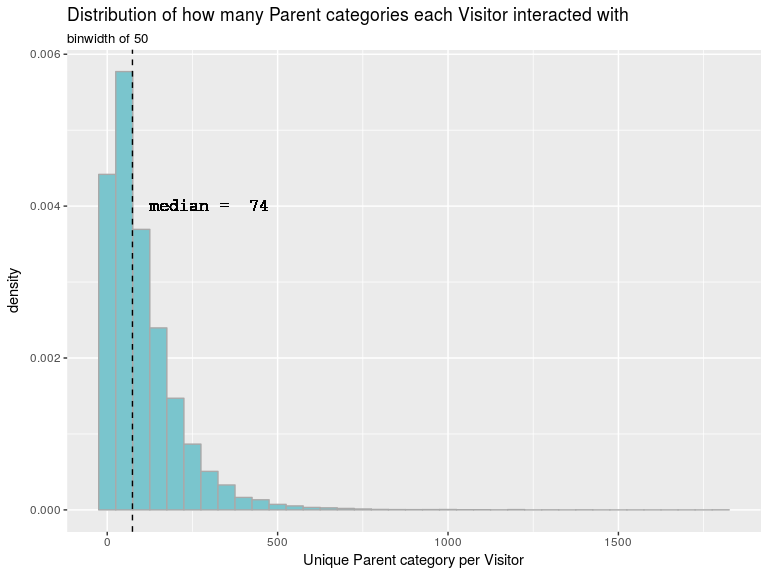

-   [Introduction](#introduction)
-   [Getting the data into R](#getting-the-data-into-r)
-   [Wrangling the Data](#wrangling-the-data)
    -   [Descriptions of the User & Items Data](#descriptions-of-the-user-items-data)
        -   [Weekly Users and Total Clicks](#weekly-users-and-total-clicks)
        -   [Description of Unique Visitors, PartNumbers, Parents](#description-of-unique-visitors-partnumbers-parents)
        -   [How do total Action Counts of each visitor distribute?](#how-do-total-action-counts-of-each-visitor-distribute)
        -   [How many unique PartNumbers is each visitor interacting with?](#how-many-unique-partnumbers-is-each-visitor-interacting-with)
        -   [How many unique Parents are visitors interacting with?](#how-many-unique-parents-are-visitors-interacting-with)
        -   [How many unique visitors have interacted with each PartNumber?](#how-many-unique-visitors-have-interacted-with-each-partnumber)
        -   [How many unique visitors have interacted with each Parent Family?](#how-many-unique-visitors-have-interacted-with-each-parent-family)
        -   [How many PartNumbers fall into each Parent Family?](#how-many-partnumbers-fall-into-each-parent-family)
        -   [(TO EXPLORE) Do Parents with more PartNumbers also have more overall visitor clicks?](#to-explore-do-parents-with-more-partnumbers-also-have-more-overall-visitor-clicks)
        -   [What types of click Actions do the visitors take?](#what-types-of-click-actions-do-the-visitors-take)
        -   [(TO EXPLORE) What percent of the time is selecting a part a precursor to adding to cart?](#to-explore-what-percent-of-the-time-is-selecting-a-part-a-precursor-to-adding-to-cart)
    -   [Collaborative Filtering Algorithms](#collaborative-filtering-algorithms)
    -   [Creating a Ratings Method](#creating-a-ratings-method)
        -   [Total Rating of Parent by Visitor](#total-rating-of-parent-by-visitor)
        -   [Example of the Total Rating pre-processing pipeline.](#example-of-the-total-rating-pre-processing-pipeline.)
    -   [Setting up a User Ratings Matrix](#setting-up-a-user-ratings-matrix)
-   [User Based Collaborative Filtering](#user-based-collaborative-filtering)
-   [Item Based Collaborative Filtering](#item-based-collaborative-filtering)

Introduction
------------

This Markdown file has most of my code, relevant plots, and explanations of decisions made so far in the data wrangling process.

I will update it with collaborative filtering model information too, as needed.

Getting the data into R
-----------------------

I used the following packages to do most of the initial data pre-processing and exploratory analysis. I'm working on an AWS AMI instance that's a linux machine with RStudio and git installed, using one of the instances publicly available and pre-configured from [Louis Aslett's website](http://www.louisaslett.com/RStudio_AMI/). I initially started with the free tier, *t2.micro* instance, but once I started the modeling phase, I scaled up to *m4.large*, which is also a general purpose computing instance but with better RAM, CPU, and better optimized memory management. AWS AMI instance costs can be calculated [here](https://calculator.s3.amazonaws.com/index.html).

The datasets queried by Matt Hayden, I've put in my own S3 Bucket on Amazon Web Services (AWS). As such, the `aws.s3` [package](https://github.com/cloudyr/aws.s3) was used to access that bucket and bring the datasets into my environment. Access Keys are needed to make read/write calls to the bucket, but I've intentionally left that code out of here.

``` r
library(aws.s3) 
library(readr) # faster alternatives to base read. methods. 
library(lubridate) # date wrangling. 
library(dplyr) # data wrangling
library(tidyr) # data wrangling
library(ggplot2) # data viz. 
library(pryr) # mem_used() and object_size() functions to manage/understand memory usage.
```

To read the Part items data and the user webactivity data from s3 I passed read\_table2() functions for reading tabular data to read items dataset and the read\_csv() function to read in the web user click data CSV files.

``` r
# items: part number, parent, catalogue, attributes/values.
items <- s3read_using(FUN = read_table2, 
                      object = "obfuscatedItems_10_17_17.txt", 
                      col_names = TRUE,
                      col_types = "cciciiiiiiiiiiiiiiiiiiiiiiiiiiiiiiiiiiiiiiii",
                      bucket = "pred498team5")

# users: click data from the company website for a random day of user's selected, their activity for past 3 months and click summaries of how they interacted with parts. 

# web user click data from Feb - Mar 2017
users_febmar17 <- s3read_using(FUN = read_csv, 
                      col_names = TRUE,
                      col_types = "ccici",
                      object = "obfuscatedWebActivity7124.csv", 
                      bucket = "pred498team5")

# web user click data from April - June 2017
users_aprmayjun17 <- s3read_using(FUN = read_csv, 
                      col_names = TRUE,
                      col_types = "ccici",
                      object = "obfuscatedWebActivity7127.csv", 
                      bucket = "pred498team5")

# web user click data from July - August 2017
users_julaug17 <- s3read_using(FUN = read_csv, 
                      col_names = TRUE,
                      col_types = "ccici",
                      object = "obfuscatedWebActivity7129.csv", 
                      bucket = "pred498team5")
```

The 3 separate user click activity queries performed by Matt on his company's graph database were required in order to get around maximum data request requirements. They contain the same information, with the following columns:

``` r
names(users_aprmayjun17)
```

    [1] "VisitorId"   "PartNumber"  "ActionId"    "ActionDate"  "ActionCount"

These 3 datasets of user click activity covering different time periods between February - August 2017 need to be unioned, or combined, into a single dataset.

``` r
users <- bind_rows(users_febmar17, users_aprmayjun17, users_julaug17)
```

Wrangling the Data
------------------

The **items** dataset contains [obfuscated](https://en.wikipedia.org/wiki/Obfuscation_(software)) information about all of the PartNumbers in the company's inventory, as well as information on the catalog that the PartNumber may have been listed in, and the first 20 attributes and attribute values describing the specifications of each PartNumber. It is a very large dataset with 583768 rows, representing the unique PartNumbers.

The only information we're particularly interested in from the **items** dataset is the Parent column, and left joining that to the matching PartNumber in the users data. Building a recommender system using the Parent family instead of the specific PartNumber will be discussed later. The items dataset has a lot of columns that describe attributes of each PartNumber and Parent. For purposes of a collaborative filtering model, we don't need to know these, any columns that include *"Attr"*, *"Val"*, or *"Catalog"* in its name are dropped.

``` r
user_items <- users %>%
  left_join(items, by = "PartNumber") %>%
  mutate(ActionDate = ymd(ActionDate), # parse into a date format.
         ActionId_label = factor(ActionId, # create labels
                                 labels = c("add to order", "select Part",
                                            "select Part detail",
                                            "print detail",
                                            "save CAD drawing detail",
                                            "print CAD drawing detail"))) %>% 
  select(-starts_with("Val"), -starts_with("Attr"), -starts_with("Catalog"))
```

Check that the left join preserved all of the original data in our full users dataset after joining in the Parent value associated with each PartNumber searched by users.

``` r
all.equal(users[1:5], user_items[1:5])
```

    [1] "Incompatible type for column `ActionDate`: x character, y numeric"

Our original datasets are taking up a lot of memory. Specifically, all other datasets other than user\_items are currently taking up 7.382793610^{8}MB of RAM. We'll remove them since everything we need in terms of user click data, the PartNumbers, Parent, actions taken, and the action date are all in the user\_items dataset. Our main user\_items dataset is quite large, requiring 4.165096310^{8} MB of RAM.

``` r
# We can remove the other datasets we don't need anymore to save available RAM. 
remove(users, items, users_febmar17, users_aprmayjun17, users_julaug17)
```

### Descriptions of the User & Items Data

The user click data (**may refer to users interchangeably as visitors**) came from three separate graph database queries that were required in order to get around maximum data request requirements. Together, the 3 user datasets represent click data from a **random sample** of accounts that purchase from the company's website who had made purchases recently. These visitor's individual click activities were queried over a time period from 2017-01-31 through 2017-09-08, covering a range of 220 days. Therefore, these data may provide insight into how users/visitors of a manufacturing supplier are interacting with the company's website, which can form the basis of learning from and providing recommendations on items tailored to each user's behavior and interests to improve the user experience and find items faster. Each variable in the main dataset is defined as follows:

-   *VisitorId*: This represents the unique account associated with the customer. It is not based on IP address or other geo-tagging information. The queries set up to curate this dataset were intentionally focused on identifying actual customers with account logins who have purchased from the company in the past. There are 23997 unique VisitorIDs in this random sample of user data.

-   *PartNumber*: This represents the ID of the specific product Part Number (ex. a pair of gloves, welding mask, pipe, cable, screw) that the VisitorId interacted with in some way(s) during their web session.

-   *Parent*: The Parent level is the hierarchical category of similar products that every specific PartNumbers roll up to. Within the copmany website, it's a hyperlink associated with the PartNumber. Parent groups will vary in size. It is a way that individual merchandising managers at the company decide to categorize and organize the hundreds of thousands of PartNumbers.

-   *ActionId*: represents the type of click action that occurred. There are 6 unique actions that a user can take, which are defined by the next variable for each value of ActionId.

-   *ActionId\_label*: The 6 unique actions for each ActionId value are
-   **1 = add to order**: the user added the PartNumber to their order.
-   **2 = select Part**: the user clicked on the PartNumber to get more information. This is the most basic user action.
-   **3 = select Part detail**: the user selected to drill in for more detail about the PartNumber interacting with.
-   **4 = print detail**: the user selected to print the detail about the PartNumber that they drilled into.
-   **5 = save CAD drawing detail**: the user saved the computer aided draft (CAD) drawing about the PartNumber.
-   **6 = print CAD drawing detail**: the user printed the computer aided draft (CAD) drawing about the PartNumber.

-   *ActionDate*: This is the date of the user's session with a specific PartNumber(s). A user may have had multiple sessions with different PartNumbers in the same day.

-   **ActionCount**: For each ActionId that a user took while interacting with a PartNumber within a session, a count of 1 is recorded. So if visitor X interacted with PartNumber Y today by going back and forth and selecting the same PartNumber three times within this day's session, visitor X's ActionCount for PartNumber Y for today will be 3.

With a baseline dataset and description of the different variables provided above, we can start describing some information about the user activity.

Again, the web activity covered by these user clicks on the website begins on 2017-01-31 and goes through 2017-09-08, covering a span of 220 days.

#### Weekly Users and Total Clicks

``` r
weekly_activity <- user_items %>%
  mutate(week_ending_date = ceiling_date(ActionDate, "week")) %>%
  group_by(week_ending_date) %>%
  summarize(unique_users = length(unique(VisitorId)),
            total_clicks = n()) %>%
  arrange(week_ending_date)

temp <- weekly_activity %>%
  mutate(week_ending_date = as.Date(week_ending_date, "%Y-%m-%d")) 


weekly_activity %>%
  mutate(week_ending_date = as.Date(week_ending_date, "%Y-%m-%d")) %>% 
  gather(key = key, value = value, -week_ending_date) %>%
  ggplot(aes(x = week_ending_date, y = value, group = key)) +
    geom_line(aes(color = key)) +
    scale_x_date(date_breaks = ("1 month"),
               date_labels = c(month.name[1:9])) +
    scale_y_continuous(labels = function(n) format(n, scientific = FALSE)) + # raw frequency scale
    labs(title = "Weekly Distribution of Sample of Users and their total click Actions",
         x = "2017",
         y = "Count") 
```


Generally, the number of unique users each week in this dataset distributes as indicated below. There was one particularly unusual week around May 14, where there was almost no user or click activity noted, as indicated by the graph above.

``` r
library(knitr)
weekly_activity %>%
  summarize(First_Quartile = quantile(unique_users, .25),
            median = median(unique_users),
            mean = mean(unique_users),
            Third_Quartile = quantile(unique_users, .75),
            Std_Deviation = sd(unique_users)
            ) %>%
  kable(caption = 'Typical Count of Unique Users by Week', align = 'c')
```

| First\_Quartile | median |   mean   | Third\_Quartile | Std\_Deviation |
|:---------------:|:------:|:--------:|:---------------:|:--------------:|
|     13347.75    |  14486 | 13853.88 |     15679.5     |    4092.181    |

The number of clicks by these unique users generally distributes as indicated by the table below. There was one particularly unusual week around May 14, where there was almost no user or click activity noted, as indicated by the graph above.

``` r
library(knitr)
weekly_activity %>%
  summarize(First_Quartile = quantile(total_clicks, .25),
            median = median(total_clicks),
            mean = mean(total_clicks),
            Third_Quartile = quantile(total_clicks, .75),
            Std_Deviation = sd(total_clicks)
            ) %>%
  kable(caption = 'Typical Count of total clicks by Week', align = 'c')
```

| First\_Quartile | median |   mean   | Third\_Quartile | Std\_Deviation |
|:---------------:|:------:|:--------:|:---------------:|:--------------:|
|     204798.2    | 287278 | 279252.3 |     361214.5    |     123685     |

#### Description of Unique Visitors, PartNumbers, Parents

This was described before when defining the variables in the data, but I'll reiterate it here too. Initial analysis shows that there are 23997 unique VisitorID numbers in the entire dataset of randomly sampled user activity from 2017-01-31 through 2017-09-08.

There are 368374 unique PartNumbers associated with the visitor web activity data.

Instead of looking at very specific PartNumbers, we can also roll the analysis up to the Parent level, which was defined previously. There are 24058 unique Parent family numbers (referred herein as Parents) associated with the visitor web activity data.

Code for getting the aforementioned details is below.

``` r
# How many Different Users are in the dataset? 
unique(user_items$VisitorId) %>% length()
# How many distinct PartNumber's are in the dataset? 
unique(user_items$PartNumber) %>% length()
# How many distinct Parent Family's of PartNumbers are in the dataset? 
unique(user_items$Parent) %>% length()
```

#### How do total Action Counts of each visitor distribute?

Action counts, as previously defined represent how often a visitor did a particular action within their session. In a single session (the day of the visitor activity interaction with a PartNumber) if they selected a PartNumber in the carousel, this is reflected as a single row in the dataset, with an ActionCount of 1. If they selected the part 2 times in this session, the ActionCount value is equal to 2.

``` r
user_items %>%
  group_by(VisitorId) %>%
  summarize(activity_count = sum(ActionCount)) %>%
  with(summary(activity_count))
```

       Min. 1st Qu.  Median    Mean 3rd Qu.    Max. 
        1.0    99.0   263.0   426.7   559.0 10176.0 

``` r
user_items %>%
  group_by(VisitorId) %>%
  summarize(activity_count = sum(ActionCount)) %>%
  ggplot(aes(activity_count, y = ..density..)) + 
  geom_histogram(binwidth = 100, colour = "black", fill = "darkgrey") +
  # median vertical line.
  geom_vline(aes(xintercept = median(activity_count)),
             color = "black", linetype = "dashed", size = 0.5) +
  geom_text(aes(0,.0015, family = "courier", label = paste("median = ", median(activity_count))),
            nudge_x = 1500, color = "black", size = 4.5) +
  labs(title = 'Distribution of Total ActionCount by each Visitor',
       subtitle = 'binwidth of 100 ',
       x = "Total Actions per Visitor")
```


After careful consideration, we have determined that total actions per PartNumber or per Parent within a single user session should not influence the implicit rating derived for the recommender. This could be for a variety of reasons, but primarily because there's not a strong theoretical basis that repeating an action in a single session with an item is an endorsement of that item. For example, selecting a part multiple times in the same session may perhaps be just as indicative of uncertainty or confusion as it could be of an interest in the item.

#### How many unique PartNumbers is each visitor interacting with?

``` r
user_items %>%
  group_by(VisitorId) %>%
  distinct(PartNumber) %>% # only keep distinct part numbers per visitor.
  summarize(unique_part_count = n()) %>% # get count within the group. 
  with(summary(unique_part_count))
```

       Min. 1st Qu.  Median    Mean 3rd Qu.    Max. 
        1.0    43.0   109.0   169.7   226.0  3847.0 

``` r
user_items %>%
  group_by(VisitorId) %>%
  distinct(PartNumber) %>% # only keep distinct part numbers per visitor.
  summarize(unique_part_count = n()) %>% # get count within the group. 
  ggplot(aes(unique_part_count, y = ..density..)) + 
  geom_histogram(binwidth = 100, colour = "darkgray", fill = "chartreuse3") +
  # median vertical line.
  geom_vline(aes(xintercept = median(unique_part_count)),
             color = "black", linetype = "dashed", size = 0.5) +
  geom_text(aes(0,.002, family = "courier", label = paste("median = ", median(unique_part_count))), 
            nudge_x = 600, color = "black", size = 4.5) +
  labs(title = 'Distribution of Unique PartNumber Interactions by each Visitor',
       subtitle = 'binwidth of 100',
       x = 'Unique PartNumbers per Visitor')
```


#### How many unique Parents are visitors interacting with?

Instead of looking at the distinct PartNumbers that each visitor interacts with, we can also look at the Parent category that each PartNumber rolls up to. By reducing the diversity of different products from the specific PartNumber to the Parent category they roll up to, we'd expect the count of interactions with unique Parents to decrease. However, this may improve the sparsity problem of a recommender system.

``` r
user_items %>%
  group_by(VisitorId) %>%
  distinct(Parent) %>% # only keep distinct parent per visitor.
  summarize(unique_parent_count = n()) %>% # get count within the group. 
  with(summary(unique_parent_count))
```

       Min. 1st Qu.  Median    Mean 3rd Qu.    Max. 
        1.0    30.0    74.0   105.9   146.0  1798.0 

``` r
user_items %>%
  group_by(VisitorId) %>%
  distinct(Parent) %>% # only keep distinct parent per visitor.
  summarize(unique_parent_count = n()) %>% # get count within the group. 
  ggplot(aes(unique_parent_count, y = ..density..)) + 
  geom_histogram(binwidth = 50, colour = "darkgray", fill = "cadetblue3") +
  # median vertical line.
  geom_vline(aes(xintercept = median(unique_parent_count)),
             color = "black", linetype = "dashed", size = 0.5) +
  geom_text(aes(0,.004, family = "courier", label = paste("median = ", median(unique_parent_count))), 
            nudge_x = 300, color = "black", size = 4.5) +
  labs(title = 'Distribution of Unique Parent Interactions',
       subtitle = 'binwidth of 50',
       x = 'Unique Parent category per Visitor')
```


#### How many unique visitors have interacted with each PartNumber?

The following summary stats distribution is potentially problematic. We have a very high dimensional dataset (more PartNumbers than users). So while each user appears to be interacting with quite a few PartNumbers as indicated by previous graphs, this graph shows that for any given PartNumber, there are typically only a handful of different visitors who have explored the exact same PartNumber.

``` r
temp1 <- user_items %>%
  group_by(PartNumber) %>%
  distinct(VisitorId) %>% # only keep distinct visitors per Item.
  summarize(unique_users_count = n()) %>%
  with(summary(unique_users_count))

temp1
```

       Min. 1st Qu.  Median    Mean 3rd Qu.    Max. 
       1.00    2.00    5.00   11.06   11.00 1893.00 

``` r
user_items %>%
  group_by(PartNumber) %>%
  distinct(VisitorId) %>% # only keep distinct visitors per Item.
  summarize(unique_users_count = n()) %>%
  mutate(unique_users_count_max500 = ifelse(unique_users_count > 500, 500, unique_users_count)) %>%
  ggplot(aes(unique_users_count_max500, y = ..density..)) + # modal value is around log(2) or 2 items.
  geom_histogram(binwidth = 10, colour = "darkgray", fill = "orangered1") +
  # median vertical line.
  geom_vline(aes(xintercept = median(unique_users_count)),
             color = "black", linetype = "dashed", size = 0.5) +
  geom_text(aes(0,.04, family = "courier", label = paste("median = ", median(unique_users_count))), 
            nudge_x = 60, color = "black", size = 4.5) +
  labs(title = 'Distribution of Unique Visitor Interactions for each PartNumber',
       subtitle = 'binwidth of 10',
       x = 'Unique Visitors per PartNumber (upper limit coerced to 500)')
```


Typically, on median, there are 5 unique visitors who've visited the same specific PartNumber, for the 368374 PartNumber categories.

#### How many unique visitors have interacted with each Parent Family?

Because Parent Family's are a broader generalization than PartNumbers, we expect to have more interactions within a single Parent Family by multiple users than at the very specific PartNumber level. The summary statistics and distributions provided below reflect that when the dimensionality of the items is rolled up from the granular PartNumber level to the more general Parent category, we get more users who have looked at the same item.

``` r
temp2 <- user_items %>%
  group_by(Parent) %>%
  distinct(VisitorId) %>% # only keep distinct visitors per Item.
  summarize(unique_users_count = n()) %>%
  with(summary(unique_users_count))

temp2
```

       Min. 1st Qu.  Median    Mean 3rd Qu.    Max. 
       1.00   18.00   41.00  105.62   99.75 7063.00 

``` r
user_items %>%
  group_by(Parent) %>%
  distinct(VisitorId) %>% # only keep distinct visitors per Item.
  summarize(unique_users_count = n()) %>%
  mutate(unique_users_count_max2000 = ifelse(unique_users_count > 2000, 2000, unique_users_count)) %>%
  ggplot(aes(unique_users_count_max2000, y = ..density..)) + 
  geom_histogram(binwidth = 50, colour = "darkgray", fill = "orchid") +
  # median vertical line.
  geom_vline(aes(xintercept = median(unique_users_count)),
             color = "black", linetype = "dashed", size = 0.5) +
  geom_text(aes(0, .005, family = "courier", label = paste("median = ", median(unique_users_count))),
            nudge_x = 300, color = "black", size = 4.5) +
  labs(title = 'Distribution of Unique Visitors for each Parent Family',
       subtitle = 'binwidth of 50',
       x = 'Unique Visitors per PartNumber (upper limit coerced to 2000)')
```



Typically, on median, there are 41 unique visitors who've visited the same Parent category, of the 24058 Parent categories.

This is 8.2 times more unique visitors per item when looking at items from the Parent category perspective than at the most granular PartNumber perspective. Perhaps it may make more sense to model recommendations at the Parent level instead of at the PartNumber level, given these differences in how many unique users are looking at identical PartNumbers versus identical Parent categories.

However, we see a bit of a presence of fat tail. The max number of unique visitors per Parent category is 7063, which means that for at least 1 outlier parent category, 29% of unique users have interacted with the same product. This could be a potential source of concern or area for further research in these data as collaborative filtering recommendations can be influenced by the most popular items when making new recommendations to users.

#### How many PartNumbers fall into each Parent Family?

It's also interesting to know when we reduce the dimensionality of the products by rolling up from PartNumber to their parent categories, how many PartNumbers make up the Parent?

``` r
user_items %>%
  group_by(Parent) %>%
  distinct(PartNumber) %>% # remove duplicate part numbers within Parent Group. 
  summarize(unique_partnumber_count = n()) %>% # return count of unique items per parent. 
  with(summary(unique_partnumber_count))
```

       Min. 1st Qu.  Median    Mean 3rd Qu.    Max. 
       1.00    2.00    6.00   15.31   14.00  786.00 

#### (TO EXPLORE) Do Parents with more PartNumbers also have more overall visitor clicks?

IF we roll PartNumbers up to the parent level, there may be a potential concern that the frequency of ratings per a Parent category may be a function of the diversity of PartNumbers that make up the Parent. If this is the case, we'd likely see a correlation pattern between the frequency of PartNumbers per Parent and the number of unique visitors per Parent. In other words, the most popular parents could just be the ones with the most PartNumbers in these data.

That could be a potential source of concern or area for further research in these data as collaborative filtering recommendations can be influenced by the most popular items.

``` r
user_items %>%
  group_by(Parent) %>%
  distinct(VisitorId) %>% # only keep distinct visitors per Item.
  summarize(unique_users_count = n()) %>%
  with(summary(unique_users_count))
```

       Min. 1st Qu.  Median    Mean 3rd Qu.    Max. 
       1.00   18.00   41.00  105.62   99.75 7063.00 

#### What types of click Actions do the visitors take?

Below is the distribution of the 6 different click actions in the visitor click dataset of 8936075 different click actions.

``` r
user_items %>%
  group_by(ActionId, ActionId_label) %>%
  summarize(frequency = n()) %>%
  arrange(desc(frequency))
```

    # A tibble: 6 x 3
    # Groups:   ActionId [6]
      ActionId           ActionId_label frequency
         <int>                   <fctr>     <int>
    1        2              select Part   4429217
    2        1             add to order   3242184
    3        3       select Part detail   1068781
    4        5  save CAD drawing detail    149957
    5        4             print detail     29177
    6        6 print CAD drawing detail     16759

``` r
# Bar graph of the 6 different Action ID Labels
user_items %>%
  group_by(ActionId, ActionId_label) %>%
  summarize(frequency = n()) %>%
  ggplot(aes(x = reorder(ActionId_label, desc(frequency)), y = frequency / sum(frequency))) +
    geom_bar(aes(fill = ActionId_label), stat = "identity") +
    labs(title = "Distribution of click Actions taken by Users",
         subtitle = "on company website or mobile app",
         x = NULL,
         y = "Percent") +
    geom_text(aes(label = frequency, family = "courier", ), 
              size = 3,
              stat= "identity", 
              vjust = -.5) +
    guides(fill=FALSE) + # remove legend
    theme(axis.text.x=element_text(angle=25,hjust=1)) + # tilt x labels
    scale_y_continuous(labels=scales::percent)
```


#### (TO EXPLORE) What percent of the time is selecting a part a precursor to adding to cart?

If most of the clicks in the dataset reflect that generally, these ultimately lead to adding items to cart, perhaps this is some evidence that customers tend to know what they want when they land on the website. They aren't just querying the site or app out of general interest.

### Collaborative Filtering Algorithms

For collaborative filtering recommender systems, the recommendations are largely based on the ability to identify commonality either between

-   1.  users who've rated similar items in a similar way which addresses a recommendation hypothesis of "who are my nearest neighbors and what do they like?". This is known as **user-based collaborative filtering**. It finds users who have similar interest in items as you and recommends new items based on what they may rate highly.

-   1.  We can also make recommendations by finding items that are similarly rated to the ones that a user has rated. This is known as **item-based collaborative filtering**. It addresses a recommendation hypothesis of "people who liked this also tend to like this."

### Creating a Ratings Method

Create the 1-2-3 scale by updating user\_items dataset. Don't need to update the ActionId\_Label.

#### Total Rating of Parent by Visitor

Show the distribution of the new total rating score.

Compare it to other ratings transformations (i.e. lognormal, square root, coerce upper limit).

#### Example of the Total Rating pre-processing pipeline.

walk through example records of the pre-processing steps for the Total Rating to illustrate the transformations.

### Setting up a User Ratings Matrix

User Based Collaborative Filtering
----------------------------------

Item Based Collaborative Filtering
----------------------------------
