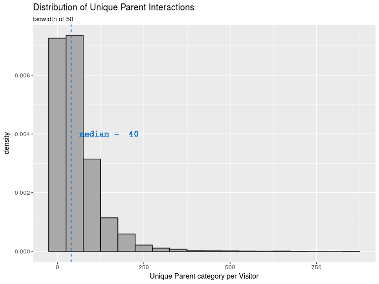

# EDA and Collaborative Filtering
Brandon Hoeft  
October 22, 2017  


## Introduction

This Markdown file has most of my code, relevant plots, and explanations of decisions made so far in the data wrangling process.

I will update it with collaborative filtering model information too, as needed. 

## Getting the data into R

I used the following packages to do most of the initial data pre-processing and exploratory analysis. I'm working on an AWS AMI instance that's a linux machine with RStudio and git installed, using one of the instances publicly available and pre-configured from [Louis Aslett's website](http://www.louisaslett.com/RStudio_AMI/). I initially started with the free tier, *t2.micro* instance, but once I started the modeling phase, I scaled up to *m4.large*, which is also a general purpose computing instance but with better RAM, CPU, and better optimized memory management. AWS AMI instance costs can be calculated [here](https://calculator.s3.amazonaws.com/index.html). 

The datasets queried by Matt Hayden, I've put in my own S3 Bucket on Amazon Web Services (AWS). As such, the `aws.s3` [package](https://github.com/cloudyr/aws.s3) was used to access that bucket and bring the datasets into my environment. Access Keys are needed to make read/write calls to the bucket, but I've intentionally left that code out of here. 


```r
library(aws.s3) 
library(readr) # faster alternatives to base read. methods. 
library(lubridate) # date wrangling. 
library(dplyr) # data wrangling
library(tidyr) # data wrangling
library(ggplot2) # data viz. 
library(pryr) # mem_used() and object_size() functions to manage/understand memory usage.
```

To read the Part items data and the user webactivity data from s3 I passed read_table2() functions for reading tabular data into the `aws.s3` functions for reading objects from AWS. 


```r
# items: part number, parent, catalogue, attributes/values.
items <- s3read_using(FUN = read_table2, 
                      object = "obfuscatedItems_10_17_17.txt", 
                      col_names = TRUE,
                      col_types = "cciciiiiiiiiiiiiiiiiiiiiiiiiiiiiiiiiiiiiiiii",
                      bucket = "pred498team5")

# users: click data from the company website for a random day of user's selected, their activity for past 3 months and click summaries of how they interacted with parts. 
users <- s3read_using(FUN = read_table2, 
                      col_names = TRUE,
                      col_types = "ccici",
                      object = "obfuscatedWebActivity_10_16_17.txt", 
                      bucket = "pred498team5")
```

## Wrangling the Dataset 

The only information I'm particularly interested in from the **items** dataset is the Parent column, and left joining that to the matching PartNumber in the users data. Building a recommender system using the Parent family instead of the specific PartNumber will be discussed later. 


```r
# left join the parent family to the users PartNumber
user_items <- users %>%
  left_join(items, by = "PartNumber") %>%
  mutate(ActionDate = ymd(ActionDate), # parse into a date format.
         ActionId_label = factor(ActionId, # create labels
                                 labels = c("add to order", "select Part",
                                            "select Part detail",
                                            "print detail",
                                            "save CAD drawing detail",
                                            "print CAD drawing detail"))) %>% 
  select(-starts_with("Val"), -starts_with("Attr"), -starts_with("Catalog"))

# Check that left join worked and initial columns match identically. 
all.equal(users[1:3], user_items[1:3])
```

```
[1] TRUE
```

```r
remove(users)
remove(items)
```

### Initial EDA

With a baseline dataset, I can start exploring some information about the users. I'll refer to them as visitors, since these are web click data about how visitors/customers of a manufacturing supplier are interacting with the company's website and mobile application. 

We'll start by asking some questions of the data. The web activity covered by these data begins on 2017-03-24 and goes through 2017-07-08, covering a span of 106 days. 

#### Summary of Unique Visitors, PartNumbers, Parents

Initial analysis shows that there are 5895 unique VisitorID numbers in this dataset. 

There are 192214 unique PartNumbers associated with the visitor web activity data.

Instead of looking at very specific PartNumbers, we can also roll the analysis up to the Parent level. The Parent level is a grouping of similar PartNumber products to a parent family. Within the website, it's a hyperlink associated with the PartNumber. Parent groups will vary. It is a way that individual merchandising managers at the company decide to categorize and split stuff up. There are 21872 unique Parent family numbers (referred herein as Parents) associated with the visitor web activity data. 

Code for getting the aforementioned details is below. 


```r
# How many Different Users are in the dataset? 
unique(user_items$VisitorId) %>% length()
# How many distinct PartNumber's are in the dataset? 
unique(user_items$PartNumber) %>% length()
# How many distinct Parent Family's of PartNumbers are in the dataset? 
unique(user_items$Parent) %>% length()
```

#### How do total Action Counts of each visitor distribute? 

Action counts are how often a visitor did a particular action within their session. In a single session (the day of the visitor activity interaction with a PartNumber) if they selected a PartNumber in the carousel, this is reflected as a single row in the dataset, with an ActionCount of 1. If they selected the part 2 times in this session, the ActionCount value is equal to 2. 


```r
user_items %>%
  group_by(VisitorId) %>%
  summarize(activity_count = sum(ActionCount)) %>%
  with(summary(activity_count))
```

```
   Min. 1st Qu.  Median    Mean 3rd Qu.    Max. 
    1.0    53.0   138.0   224.3   289.0  4191.0 
```

```r
user_items %>%
  group_by(VisitorId) %>%
  summarize(activity_count = sum(ActionCount)) %>%
  ggplot(aes(activity_count, y = ..density..)) + 
  geom_histogram(binwidth = 100, colour = "black", fill = "darkgrey") +
  # median vertical line.
  geom_vline(aes(xintercept = median(activity_count)),
             color = "dodgerblue3", linetype = "dashed", size = 0.5) +
  geom_text(aes(0,.002, family = "courier", label = paste("median = ", median(activity_count))),
            nudge_x = 700, color = "dodgerblue3", size = 4.5) +
  labs(title = 'Distribution of Total interactions with PartNumbers',
       subtitle = 'For each Visitor',
       x = "Total Actions per Visitor")
```

<!-- -->

After careful consideration, it was determined that total actions per PartNumber or per Parent should not influence the implicit rating derived for the recommender. This could be for a variety of reasons, such as selecting a part multiple times in the same session may perhaps be just as indicative of uncertainty as it could be of endorsing that part. 

#### How many unique PartNumbers is each visitor interacting with? 


```r
user_items %>%
  group_by(VisitorId) %>%
  distinct(PartNumber) %>% # only keep distinct part numbers per visitor.
  summarize(unique_part_count = n()) %>% # get count within the group. 
  with(summary(unique_part_count))
```

```
   Min. 1st Qu.  Median    Mean 3rd Qu.    Max. 
   1.00   23.00   57.00   91.15  118.00 1594.00 
```

```r
user_items %>%
  group_by(VisitorId) %>%
  distinct(PartNumber) %>% # only keep distinct part numbers per visitor.
  summarize(unique_part_count = n()) %>% # get count within the group. 
  ggplot(aes(unique_part_count, y = ..density..)) + 
  geom_histogram(binwidth = 50, colour = "black", fill = "darkgrey") +
  # median vertical line.
  geom_vline(aes(xintercept = median(unique_part_count)),
             color = "dodgerblue3", linetype = "dashed", size = 0.5) +
  geom_text(aes(0,.004, family = "courier", label = paste("median = ", median(unique_part_count))), 
            nudge_x = 250, color = "dodgerblue3", size = 4.5) +
  labs(title = 'Distribution of Unique PartNumber Interactions by each Visitor',
       subtitle = 'binwidth of 50',
       x = 'Unique PartNumbers per Visitor')
```

<!-- -->
#### How many unique Parents are visitors interacting with? 

Instead of looking at the distinct PartNumbers that each visitor interacts with, we can also look at the Parent category that each PartNumber rolls up to. By reducing the diversity of different products from the specific PartNumber to the Parent category they roll up to, we'd expect the count of interactions with unique Parents to decrease. However, this may improve the sparsity problem of a recommender system. 


```
   Min. 1st Qu.  Median    Mean 3rd Qu.    Max. 
   1.00   16.50   40.00   59.38   80.00  843.00 
```

<!-- -->
#### How many unique visitors have interacted with each PartNumber? 


```
   Min. 1st Qu.  Median    Mean 3rd Qu.    Max. 
  1.000   1.000   2.000   2.796   3.000 378.000 
```

<!-- -->

#### How many unique visitors have interacted with each Parent Family? 

Because Parent Family's are a broader generalization than PartNumbers, we'd 
expect to have more interactions within Parent Family than at the very specific PartNumber level and the summary statistics and distributions reflect that. 


```
   Min. 1st Qu.  Median    Mean 3rd Qu.    Max. 
   1.00    3.00    6.00   16.01   15.00 1170.00 
```

<!-- -->
#### How many PartNumbers fall into each Parent Family?

It's also interesting to know when we reduce the dimensionality of the products by rolling up from PartNumber to their parent categories, how many PartNumbers make up the Parent? 


```
   Min. 1st Qu.  Median    Mean 3rd Qu.    Max. 
  1.000   2.000   4.000   8.788   8.000 582.000 
```

#### Do Parents with more PartNumbers also have more overall visitor clicks? 

IF we roll PartNumbers up to the parent level, there may be a potential concern that the frequency of ratings per a Parent category may be a function of the diversity of PartNumbers that make up the Parent. If this is the case, we'd likely see a correlation pattern between the frequency of PartNumbers per Parent and the number of unique visitors per Parent. In other words, the most popular parents could just be the ones with the most PartNumbers in these data. 

That could be a potential source of concern or area for further research in these data as collaborative filtering recommendations can be influenced by the most popular items. 

#### What types of click Actions do the visitors take? 

### Creating a Ratings Method

Create the 1-2-3 scale by updating user_items dataset. Don't need to update the ActionId_Label.

#### Total Rating of Parent by Visitor 

#### Example of the Total Rating pre-processing pipeline.
