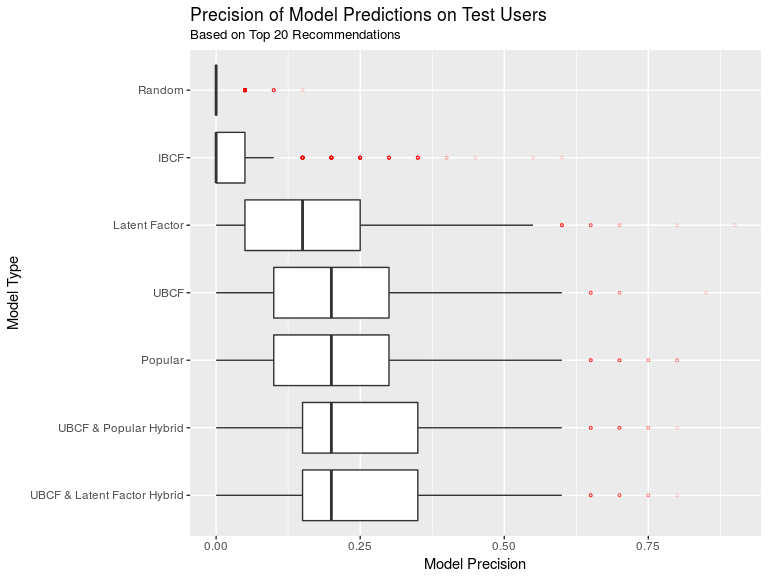
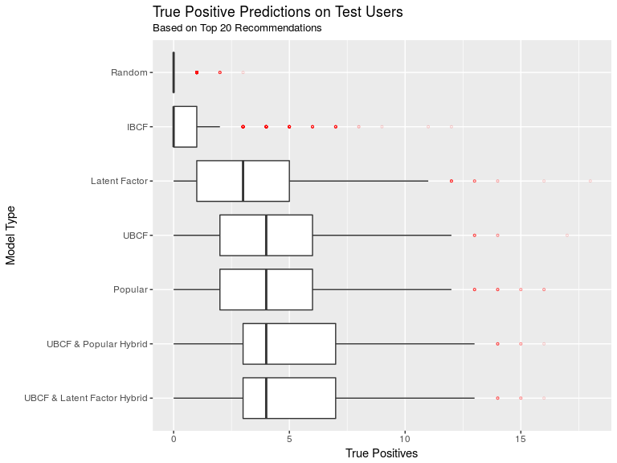

-   [Introduction](#introduction)
-   [Summary Stats per Model](#summary-stats-per-model)
-   [Visual Comparison of Model Precision of Recommendations](#visual-comparison-of-model-precision-of-recommendations)

Introduction
------------

This document provides model comparison on the test user data for each of the different final types of recommender systems. Evaluations are made primarily by using precision, since we have constrained the problem to a Top 20 recommendations system.

Precision here tells us, of the top 20 recommendations predicted by the model for for each test user (unseen cases by the trained models), how many of these were actual parent items that the user did in fact rate? Higher values indicate that the model does a good job of making relevant item suggestions to users.

Summary Stats per Model
-----------------------

Distributions of the precision metric on test users for each model type candidate.

| model\_version              |  minimum|  first\_quartile|  median|  mean|  third\_quartile|   max|
|:----------------------------|--------:|----------------:|-------:|-----:|----------------:|-----:|
| UBCF & Latent Factor Hybrid |        0|             0.15|    0.20|  0.24|             0.35|  0.80|
| UBCF & Popular Hybrid       |        0|             0.15|    0.20|  0.24|             0.35|  0.80|
| Popular                     |        0|             0.10|    0.20|  0.23|             0.30|  0.80|
| UBCF                        |        0|             0.10|    0.20|  0.22|             0.30|  0.85|
| Latent Factor               |        0|             0.05|    0.15|  0.16|             0.25|  0.90|
| IBCF                        |        0|             0.00|    0.00|  0.05|             0.05|  0.60|
| Random                      |        0|             0.00|    0.00|  0.01|             0.00|  0.15|

Distributions of the True Positive Count for test users for each model type candidate. Note, that this information correlates directly to the precision rate above. It just presents a different number to compare.

| model\_version              |  minimum|  first\_quartile|  median|  mean|  third\_quartile|  max|
|:----------------------------|--------:|----------------:|-------:|-----:|----------------:|----:|
| UBCF & Latent Factor Hybrid |        0|                3|       4|  4.75|                7|   16|
| UBCF & Popular Hybrid       |        0|                3|       4|  4.70|                7|   16|
| Popular                     |        0|                2|       4|  4.60|                6|   16|
| UBCF                        |        0|                2|       4|  4.31|                6|   17|
| Latent Factor               |        0|                1|       3|  3.29|                5|   18|
| IBCF                        |        0|                0|       0|  0.99|                1|   12|
| Random                      |        0|                0|       0|  0.14|                0|    3|

Visual Comparison of Model Precision of Recommendations
-------------------------------------------------------

Overlapping density plots for each model's precision of recommendations for the same test users.

Overlapping density plots for each model's True Positive Recommendations count for the same test users.

Panel Box Plots of Top 20 Recommendations precision metric for the same test users.

Panel Box Plots of True Positive Recommendations count for the same test users.

